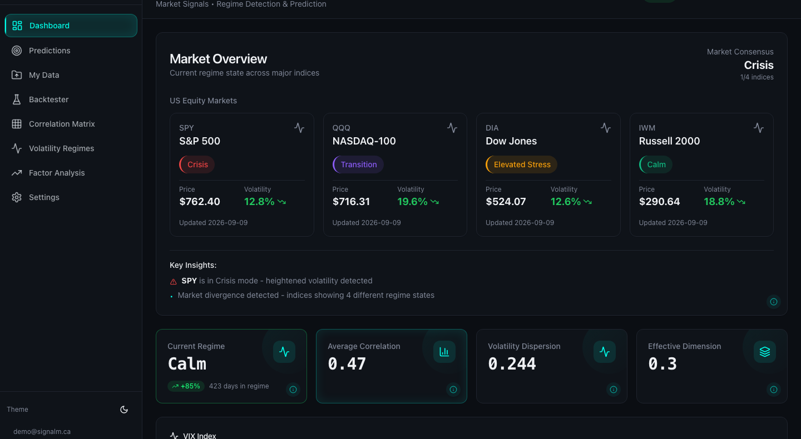
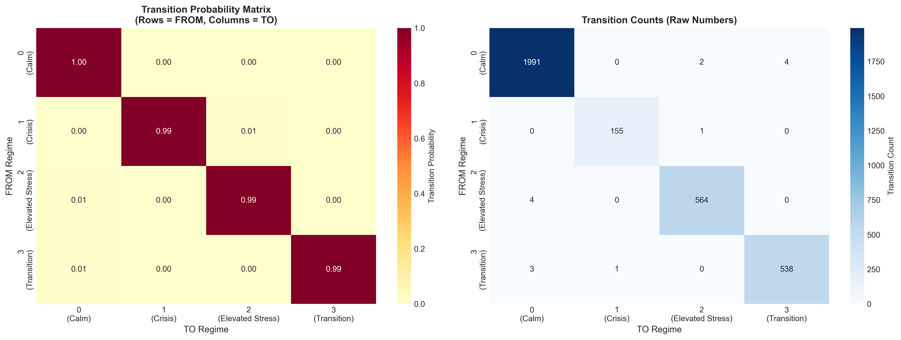
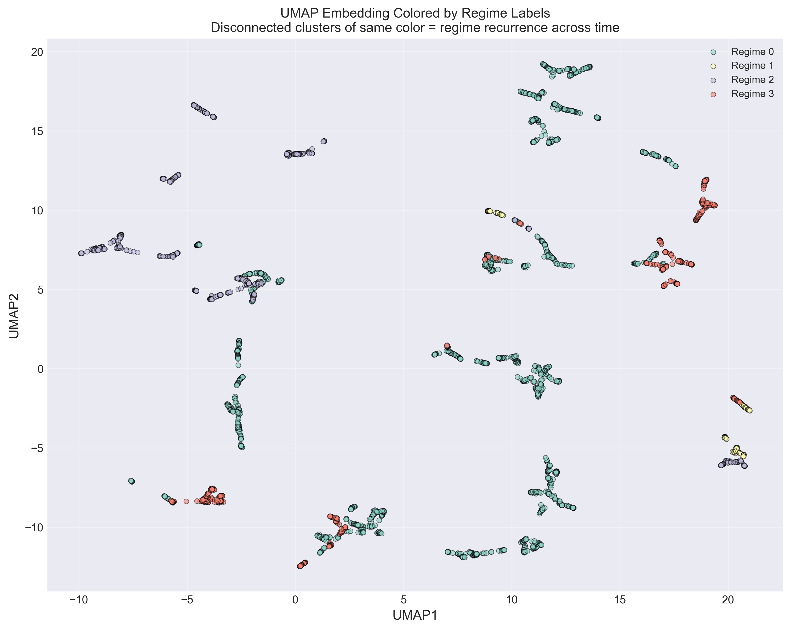

# SignalM

**Market regime detection and prediction, from research to a live platform.**

[](https://signalm.ca)


SignalM identifies the current market regime (Calm, Crisis, Elevated Stress, Transition) across major US equity indices and forecasts regime transitions at horizons from one day to three years. It began as a two-month quantitative research study on 500+ S&P 500 constituents and is now a full-stack platform with daily data refresh, a regime-aware backtester, and the ability to run the same analysis on a user's own price data.

**Live:** [signalm.ca](https://signalm.ca) (guest access available, no sign-up required)



---

## What it does

| Page | What you get |
|------|--------------|
| **Dashboard** | Current regime for SPY, QQQ, DIA, and IWM with price and volatility, a market-wide consensus, VIX, and the structural metrics behind the regime call (average correlation, volatility dispersion, effective dimension). |
| **Predictions** | Four models per index (Markov chain, Hidden Markov Model, Random Forest, XGBoost) at 11 trained horizons from 1 to 365 days, an HMM-weighted ensemble, custom horizons up to 1,095 days, transition heatmap, expected regime durations, projected regime trajectory, a what-if tool that reprices predictions under adjusted market features, backtest of predicted vs. actual regimes, and CSV export. |
| **Backtester** | Regime-conditioned allocations across SPY, 11 sector ETFs, and cash. Set a different portfolio per regime, transaction costs, and a date range; get an equity curve vs. SPY, Sharpe, CAGR, max drawdown, Calmar, win rate, rebalance count, and a per-regime attribution. Fully vectorized, runs a decade of daily rebalancing in well under a second. |
| **Correlation Matrix** | Sector ETF correlation matrix, rolling correlations, regime-conditioned correlations, PCA structure, and drill-down on any sector pair. |
| **Volatility Regimes** | Regime-conditioned risk and return statistics per index, with regime overlays on price history. |
| **Factor Analysis** | PCA structure of the market: explained variance, loadings, component time series, and per-regime factor scores. |
| **My Data** | Upload your own price data (CSV wide or long, Excel, or JSON). SignalM runs the full pipeline on it: feature engineering, K-Means regime detection with volatility-ranked labels, transition analysis, performance by regime, and Markov/HMM predictions, presented in a five-tab dashboard. Datasets persist per user. |

**Live data.** A scheduled GitHub Actions workflow runs every weekday morning: it fetches new prices incrementally, refits per-index regimes, rebuilds derived datasets, precomputes the expensive API responses, and redeploys the API. The UI shows data freshness from `/api/refresh/status`.

**Accounts.** Supabase email/password auth with protected routes and JWT verification on the API. A guest mode opens every analysis page without an account; uploads require sign-in.

---

## How it works

```
500+ S&P 500 constituents, sector ETFs, VIX (2012 to present)
        │
        ▼
Feature engineering ──── rolling volatility, dispersion, pairwise correlation
        │                (21 / 63 / 126 / 252 day windows), PCA variance share,
        │                cumulative variance, effective dimension
        ▼
K-Means regime detection (K = 4) ──── validated against drawdowns, known
        │                             events, UMAP structure, persistence
        ▼
Prediction models ──── Markov chain, HMM, Random Forest, XGBoost
        │              trained per index at 11 horizons, chronological split
        ▼
Offline precompute ──── models and heavy analytics served as static JSON
        │
        ▼
FastAPI ──── 6 routers: predictions, backtester, correlations, PCA,
        │    custom data, refresh status (plus regimes, market, indices)
        ▼
React dashboard ──── Vite, TanStack Query, shadcn/ui, Recharts
```

---

## Research

The platform is built on a research phase that ran before any application code was written. The full write-up is in [`docs/FINDINGS.md`](docs/FINDINGS.md); the PCA interpretation is in [`docs/pca_interpretation.md`](docs/pca_interpretation.md).

### Feature space

| Feature | Description | Formula |
|---------|-------------|---------|
| `avg_vol` | Average realized volatility (annualized) | σ = √(252 × Var(R)) |
| `vol_dispersion` | Cross-sectional spread of volatility | std(σ₁, σ₂, …, σₙ) |
| `avg_correlation` | Mean pairwise correlation | avg(ρᵢⱼ) for i ≠ j |
| `pc1_var` | Variance explained by the first principal component | λ₁ / Σλᵢ |
| `cum_var_3` | Cumulative variance of the first three components | (λ₁+λ₂+λ₃) / Σλᵢ |
| `effective_dimension` | Eigenvalue concentration (participation ratio) | exp(−Σ pᵢ log pᵢ), pᵢ = λᵢ / Σλⱼ |

A rising PC1 share and a falling effective dimension mean the market is collapsing onto a single risk-on/risk-off factor, which is the signature of stress.

### Regimes

| Regime | % of time | Mean duration | Characteristics |
|--------|-----------|---------------|-----------------|
| **Calm** | 61% | 285 days | Low volatility (0.24), low correlation (0.28), high effective dimension (4.9) |
| **Crisis** | 5% | 156 days | High volatility (0.35), high correlation (0.45), low effective dimension (3.8) |
| **Elevated Stress** | 17% | 142 days | Medium volatility (0.28), medium correlation (0.35) |
| **Transition** | 17% | 135 days | Mixed characteristics, sits between regimes |

Regimes are highly persistent: only 15 switches in 3,264 trading days. Same-colored clusters that are disconnected in the UMAP embedding are the same regime recurring years apart.

<p align="center">
  
</p>

### Prediction results

Test period 2021 to 2024, strictly chronological 70/30 split. Random Forest and XGBoost use 36 lagged market features and do **not** see the current regime.

| Horizon | Markov baseline | HMM (features only) | Random Forest | XGBoost |
|---------|-----------------|---------------------|---------------|---------|
| **1-day** | 99.28% | 86.3% | **91.06%** | 81.81% |
| **7-day** | 95.99% | | **83.21%** | 84.76% |
| **30-day** | 92.32% | | **83.30%** | 76.87% |

The Markov baseline is strong because regimes persist, so "predict the same regime" is itself a 99% one-day baseline. The interesting question is how much signal the features carry beyond that.

**Evaluating honestly.** Early results were inflated. The Markov chain had been scored on the same data used to fit its transition matrix, and the tree models had the current regime as a one-hot feature, which let them memorize the persistence baseline (Random Forest 99.28%, XGBoost 99.08%). Fitting transition matrices on the training window only and removing the current regime from the feature set produced the numbers above. They are lower and far more useful: volatility dispersion and PCA concentration are the top predictors, and 5- and 21-day lags outperform 1-day lags for catching transitions. Details in [`docs/ACCURACY_FIX.md`](docs/ACCURACY_FIX.md).

<p align="center">
  
</p>

---

## Tech stack

| Layer | Technology |
|-------|------------|
| Research and ML | Python 3.11, NumPy, Pandas, scikit-learn, XGBoost, hmmlearn, UMAP, SciPy |
| API | FastAPI, Pydantic v2, Uvicorn |
| Frontend | React 18, TypeScript, Vite, TanStack Query, shadcn/ui, Radix, Tailwind, Recharts |
| Auth and storage | Supabase (Auth, Storage) |
| Data | yfinance, incremental daily fetch |
| Hosting | Vercel (frontend), AWS Lightsail Containers (API, Docker) |
| CI/CD | GitHub Actions: OIDC deploy to ECR and Lightsail, scheduled data refresh |
| Tests | pytest (142 tests across the API, backtester, upload pipeline, and refresh pipeline) |

---

## Project structure

```
SignalM/
├── api/                    # FastAPI application
│   ├── main.py             # App, CORS, regime / market / index endpoints
│   ├── routers/            # predictions, backtester, correlations, pca, custom_data, refresh_status
│   ├── dependencies/       # Supabase JWT auth
│   └── utils/              # backtest engine, custom-data pipeline, file parser, storage
├── frontend/               # React + TypeScript dashboard (Vite)
│   └── src/
│       ├── pages/          # Dashboard, Predictions, Backtester, Correlation, Volatility, Factors, Upload, Auth, Settings
│       ├── components/     # Page components and shadcn/ui primitives
│       ├── hooks/          # TanStack Query data hooks
│       └── lib/            # API client, ensemble weighting, Supabase client
├── src/                    # Research and ML pipeline
│   ├── analysis/           # Rolling statistics, PCA, PCA interpretation
│   ├── regime/             # Feature engineering, K-Means, validation, transitions, model training, inference
│   ├── data/               # Market data fetch, per-index regime detection
│   └── visualization/      # EDA plots, UMAP
├── scripts/
│   ├── refresh_pipeline.py # Daily refresh: fetch, refit, rebuild, precompute
│   ├── precompute.py       # Generate precomputed API responses
│   ├── incremental_fetch.py
│   └── aws/                # One-time AWS setup scripts
├── models/                 # Trained models per index (SPY, QQQ, DIA, IWM)
├── precomputed/            # Static JSON served by the API
├── regime_results/         # Regime labels, validation charts, transition analysis
├── pca_data/               # PCA components and loadings
├── data/                   # Price data (S&P 500 constituents, indices, sector ETFs, VIX)
├── tests/                  # pytest suite
├── docs/                   # Findings, accuracy audit, API docs, deployment guide
├── .github/workflows/      # deploy_api.yml, daily_refresh.yml
├── Dockerfile
└── requirements.txt
```

---

## Running locally

**Prerequisites:** Python 3.11+, Node.js 18+.

```bash
git clone https://github.com/Akishai18/SignalM.git
cd SignalM
```

**Backend**

```bash
python -m venv .venv
source .venv/bin/activate        # Windows: .venv\Scripts\activate
pip install -r requirements.txt

cp .env.example .env             # Supabase keys; only needed for auth and uploads
uvicorn api.main:app --reload --port 8000
```

The API serves precomputed results out of the box. Interactive docs at http://localhost:8000/docs, health check at http://localhost:8000/api/health.

**Frontend**

```bash
cd frontend
npm install
npm run dev                      # http://localhost:8080
```

Configure `frontend/.env.local` with `VITE_API_URL` (defaults to the local API) and, for sign-in, `VITE_SUPABASE_URL` and `VITE_SUPABASE_ANON_KEY`. Guest mode works without Supabase.

**Tests**

```bash
pytest tests/
```

**Regenerating the research and model artifacts** (optional, everything is committed)

```bash
PYTHONPATH=src python src/regime/run_regime_clustering.py     # market-wide regimes
python src/regime/train_multi_index_models.py                 # per-index models, all horizons
python scripts/precompute.py                                  # static API responses
python scripts/refresh_pipeline.py --dry-run                  # check data staleness
```

---

## API overview

| Group | Endpoints |
|-------|-----------|
| Regimes and market | `/api/regimes/{current,history,labels,performance}`, `/api/market/{spy,vix}/{current,history}`, `/api/indices/{symbol}/...` |
| Predictions | `/api/predictions/{symbol}/current`, `/horizon/{days}`, `/model/{name}/horizon/{days}`, `/accuracy`, `/trajectory/{days}`, `/transitions`, `/backtest`, `/what-if`, `/export`, `/compare` |
| Backtester | `GET /api/backtester/assets`, `POST /api/backtester/run` |
| Correlations | `/api/correlations/{sector-matrix,rolling,regime-correlation,pca-structure,sector-pair-detail}` |
| PCA | `/api/pca/{structure,loadings,components,regime-scores,scatter}` |
| Custom data | `POST /api/custom/upload`, then `/api/custom/{session_id}/{status,overview,history,transitions,performance,features,predictions,predict}` |
| Status | `/api/refresh/status`, `/api/health` |

Full reference: [`docs/API_DOCUMENTATION.md`](docs/API_DOCUMENTATION.md).

---

## Deployment

- **Frontend** on Vercel, pointed at the API through `VITE_API_URL`.
- **API** as a Docker container on AWS Lightsail. `.github/workflows/deploy_api.yml` builds the image, pushes to ECR, and rolls out a new Lightsail deployment using GitHub OIDC (no stored AWS keys).
- **Data refresh** in `.github/workflows/daily_refresh.yml` runs weekdays at 08:00 UTC, commits refreshed data, and triggers the API deploy.

Setup guide: [`docs/AWS_DEPLOY.md`](docs/AWS_DEPLOY.md).

---

## Documentation

- [`docs/FINDINGS.md`](docs/FINDINGS.md): research results and model comparison
- [`docs/ACCURACY_FIX.md`](docs/ACCURACY_FIX.md): the evaluation-leakage audit and fix
- [`docs/pca_interpretation.md`](docs/pca_interpretation.md): economic reading of the PCA factors
- [`docs/API_DOCUMENTATION.md`](docs/API_DOCUMENTATION.md): endpoint reference
- [`docs/AWS_DEPLOY.md`](docs/AWS_DEPLOY.md): infrastructure and deployment

---

## Disclaimer

SignalM is a research and educational tool. It is not investment advice, not a trading signal service, and makes no guarantee about future performance. Consult a qualified financial professional before making investment decisions.

## License

MIT. See [LICENSE](LICENSE).

## Author

**Akishai Sabaratnasarma**, Software Engineering, University of Waterloo.
Questions or ideas: [open an issue](https://github.com/Akishai18/SignalM/issues).
